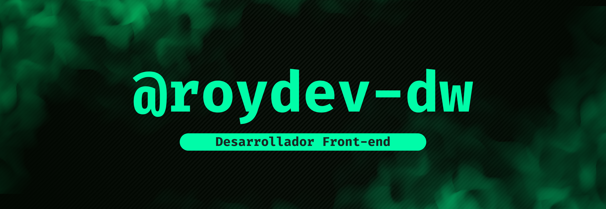

<h1 align="center">Hola. Soy Röy </h1>

  

## &nbsp;&nbsp;Sobre mí

  

- :school: Soy estudiante de tercer año de Ingeniería en Informática en [DUOC UC.](https://www.duoc.cl/sedes/plaza-oeste/)
- :technologist: Me encanta el Desarrollo Web.
- :computer: Actualmente uso tecnologías como `Html`, `Css`, `Scss`, `Bootstrap`, `Tailwind`, `Django` y `Angular`.
- :sound: Siempre escucho musica rap, si quieres puedes usar mi playlist [Programando Rap](https://open.spotify.com/playlist/2ZGxQS6BHbuHrm8NbapqX6?si=2990f6cc071b4bf1) en Spotify
- :thinking: I’m currently open for a new `job opportunity`, this is [MY RESUME](http://lnkiy.in/Ahmed_Hossam_Resume).
- :boom: You can visit [MY WEBSITE](https://cutt.ly/Ahmed_Hossam_Website).
 

<!--
**roydev-dw/roydev-dw** is a ✨ _special_ ✨ repository because its `README.md` (this file) appears on your GitHub profile.

Here are some ideas to get you started:

- 🔭 I’m currently working on ...
- 🌱 I’m currently learning ...
- 👯 I’m looking to collaborate on ...
- 🤔 I’m looking for help with ...
- 💬 Ask me about ...
- 📫 How to reach me: ...
- 😄 Pronouns: ...
- ⚡ Fun fact: ...
-->
